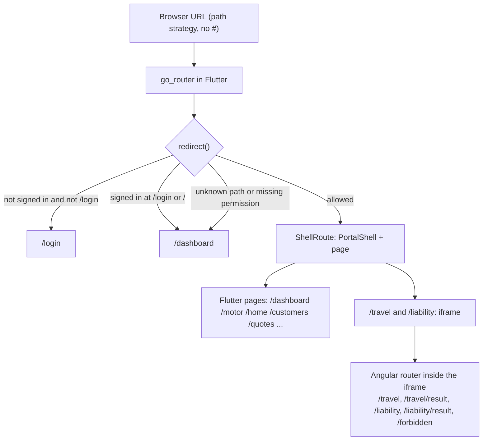
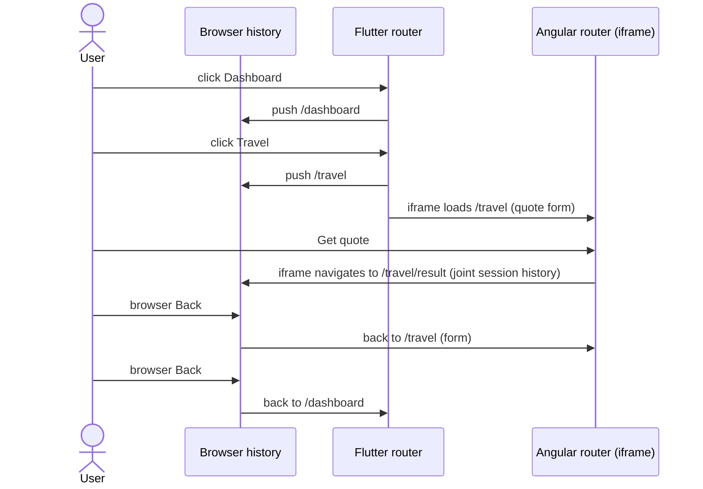

# Routing Flow

## Route ownership

```mermaid
flowchart TD
    URL["Browser URL (path strategy, no #)"] --> GR["go_router in Flutter"]
    GR --> Redirect{"redirect()"}
    Redirect -- "not signed in and not /login" --> Login["/login"]
    Redirect -- "signed in at /login or /" --> Dashboard["/dashboard"]
    Redirect -- "unknown path or missing permission" --> Dashboard
    Redirect -- "allowed" --> Shell["ShellRoute: PortalShell + page"]
    Shell --> Flutter["Flutter pages: /dashboard /motor /home /customers /quotes ..."]
    Shell --> Iframe["/travel and /liability: iframe"]
    Iframe --> AR["Angular router inside the iframe<br/>/travel, /travel/result, /liability, /liability/result, /forbidden"]
```

## Browser history

```mermaid
sequenceDiagram
    actor U as User
    participant B as Browser history
    participant F as Flutter router
    participant I as Angular router (iframe)

    U->>F: click Dashboard
    F->>B: push /dashboard
    U->>F: click Travel
    F->>B: push /travel
    F->>I: iframe loads /travel (quote form)
    U->>I: Get quote
    I->>B: iframe navigates to /travel/result (joint session history)
    U->>B: browser Back
    B->>I: back to /travel (form)
    U->>B: browser Back
    B->>F: back to /dashboard
```

The iframe's navigation is part of the tab's joint session history, so Back first steps back inside Angular, then in Flutter.
